<a name="m300-leistungsbeurteilung-2"></a>
# M300 Leistungsbeurteilung 3
Plattformübergreifende Dienste in ein Netzwerk integrieren

<a name="autor"></a>
## Autor
Tharsan Pethurupillai

<a name="inhaltsverzeichnis"></a>
## Inhaltsverzeichnis

- [M300 Leistungsbeurteilung 3](#m300-leistungsbeurteilung-3)
  - [Autor](#autor)
  - [Inhaltsverzeichnis](#inhaltsverzeichnis)
  - [Docker](#docker)
    - [Befehle](#befehle)
    - [Netzwerkplan](#netzwerkplan)
    - [Webserver erstellen](#webserver-erstellen)
      - [Dockerfile](#dockerfile)
      - [Container starten](#container-starten)
    - [Service Überwachung](#service-überwachung)
    - [Container Sicherheit](#container-sicherheit)
      - [Read-Only](#read-only)
    - [Kubernetes](#kubernetes)
    - [Service](#service)
    - [Vergleich Vorwissen - Wissenszuwachs](#vergleich-vorwissen---wissenszuwachs)
    - [Reflexion](#reflexion)
      - [Tag 5](#tag-5)
      - [Tag 6](#tag-6)
      - [Tag 7](#tag-7)

## Docker
Docker ist eine Freie Software zur Isolierung von Anwendungen mit Hilfe von Containervirtualisierung. Docker vereinfacht die Bereitstellung von Anwendungen, weil sich Container, die alle nötigen Pakete enthalten, leicht als Dateien transportieren und installieren lassen.

### Befehle

| Befehl            | Funktion                                             |
| -------------     | ---------------------------------------------------- | 
| ```docker pull```      | Holt ein Image. |
| ```docker run```      | Started VM mit dem ausgewähltem Image. |
| ```docker ps```      | Zeigt laufende Maschinen. |
| ```docker version```      | Zeigt die Docker Version von Echo-Client und Server an. |
| ```docker images```        | Listet alle Docker Images auf. |
| ```docker exec```       | Führt einen Befehl in einem laufenden Container aus. |
| ```docker search```    | Durchsucht das Docker Hub nach Images. |
| ```docker attach```      | Hängt etwas an einen laufenden Container an. |
| ```docker commit```   | Erstellt ein neues Image mit den Änderungen, die an einem Container vorgenommen worden sind. |
| ```docker stop```   | Haltet die gewünschte Maschine an. |

### Netzwerkplan


### Webserver erstellen
Hier wird kurz erklärt wie man eine einfache Webseite anhand eines Containers anbietet.

#### Dockerfile
```
#
#	Einfache Apache Umgebung
#
FROM ubuntu:22.04
RUN apt-get update
RUN apt-get -q -y install apache2 
# Konfiguration Apache
ENV APACHE_RUN_USER www-data
ENV APACHE_RUN_GROUP www-data
ENV APACHE_LOG_DIR /var/log/apache2
RUN mkdir -p /var/lock/apache2 /var/run/apache2
EXPOSE 80
VOLUME /var/www/html
CMD /bin/bash -c "source /etc/apache2/envvars && exec /usr/sbin/apache2 -DFOREGROUND"
```

#### Container starten
Zuerst Image erstellen:
```
docker build .
```
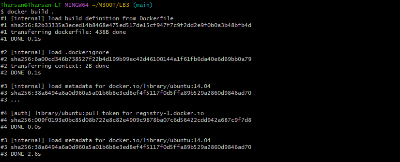

Danach Image umbennen, damit es einfacher zu erkennen ist:
``` 
docker tag <ID> apache2
```
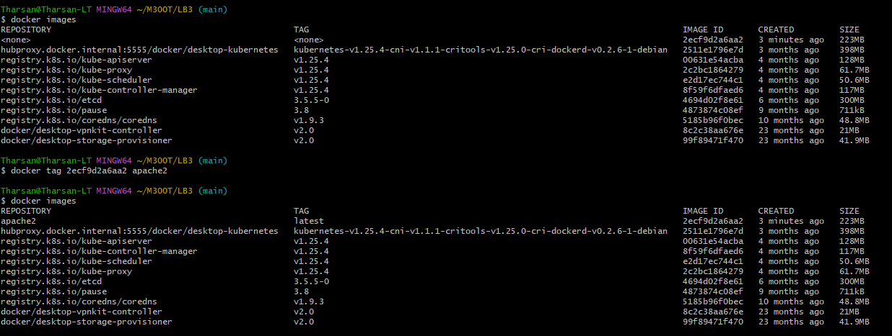

Nun kann man die VM starten (hier wird der Port 8080 weitergeleitet):
```
docker run --rm -d -p 8080:80 -v web:/var/www/html --name apache2 <ID>
```
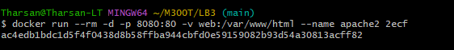

So könnte man im nachhinein auf die Shell zugreifen (Beachten, dass winpty benutzt wird):
```
winpty docker exec -it apache2 bash
```
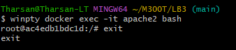

So könnte man auch die Webseite abändern:
```
docker cp C:\Users\Thars\M300T\LB3\index.html apache2:/var/www/html/
```
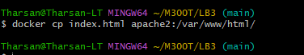

Hier könnt Ihr das Resultat mit dem neuen Directory sehen.
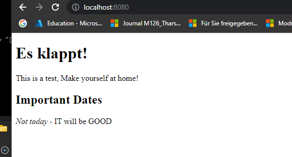

### Service Überwachung
Dieser Service ist über prometheus einzurichten
Zuerst einmal muss ein yaml-file erstellt werden mit dem folgenden Inhalt.

```
lobal:
  scrape_interval:     15s # By default, scrape targets every 15 seconds.

# A scrape configuration containing exactly one endpoint to scrape:
# Here it's Prometheus itself.
scrape_configs:

  - job_name: 'prometheus'

    # Override the global default and scrape targets from this job every 5 seconds.
    scrape_interval: 5s

    static_configs:
      - targets: ['localhost:9090']


  - job_name: 'node'

    static_configs:
      - targets: ['0.0.0.0:8080']

```

```
docker run -p 9090:9090 -v prometheus.yaml:/etc/prometheus/prometheus.yaml prom/prometheus
```
Somit kann man nun im Browser mit "localhost:9090" auf den Service zugreifen.

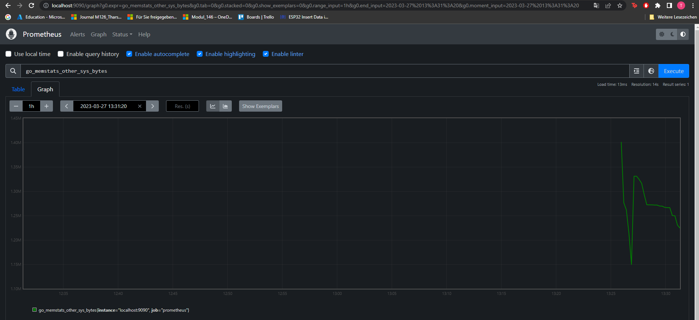

### Container Sicherheit
Hiermit kann der normale User keine sudo Befehle ausführen.
Das Dockerfile muss folgendes beinhalten:
```
RUN useradd -ms /bin/bash Username
USER Username
WORKDIR /homedir
```

#### Read-Only
Wenn man den Docker mit der Option read-only startet, können keine Änderungen am Dateisystem vorgenommen werden (auch mit sudo nicht):
```
docker run --read-only -d -t --name apache2 Image
```
### Kubernetes

Zuerst muss eine yaml Datei erstellt werden:
```
touch deployment.yaml
```
Die Datei soll folgendes beinhalten:
```
apiVersion: apps/v1
kind: Deployment
metadata:
  name: kubdeployment
  labels:
    app: kub
spec:
  replicas: 5
  selector:
    matchLabels:
      app: kub
  template:
    metadata:
      labels:
        app: kub
    spec:
      containers:
      - name: kub-webserver
        image: webserver
        imagePullPolicy: Always
        ports:
        - containerPort: 80
```
Jetzt muss das yaml file noch applied werden, damit die Container erstellt werden. Dafür muss man folgendes eingeben:
```
kubectl apply -f deployment.yaml
```
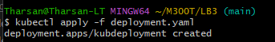

Mit folgendem Command kann man nun die Pods anzeigen:
```
kubectl get pods
```
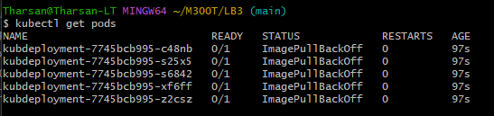

### Service

Zuerst ein loadbalance.yaml file erstellen mit folgendem Inhalt:
```
apiVersion: v1
kind: Service
metadata:
  name: kubservice
  annotations:
    service.beta.kubernetes.io/linode-loadbalancer-throttle: "4"
  labels:
    app: kubservice
spec:
  type: LoadBalancer
  ports:
  - name: http
    port: 80
    protocol: TCP
    targetPort: 80
  selector:
    app: kub
  sessionAffinity: None
```
Nun muss man den Service ausführen:
```
kubectl apply -f loadbalance.yaml
```
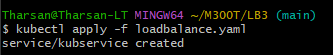
Und so kann man ihn anzeigen:
```
kubectl get services
```
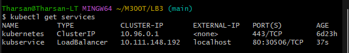

Nun kann man auf die Website zugreifen:
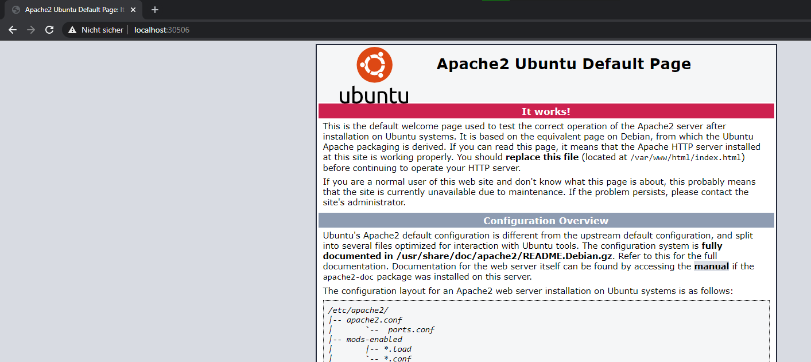

### Vergleich Vorwissen - Wissenszuwachs


### Reflexion

#### Tag 5
Heute habe ich mich mit dem Docker Theorie befasst und anschliessend ausgetestet. Dafür musste ich zuerst Docker auf meinem Laptop installieren, aber Docker verursachte viele Probleme. Ich musste Docker erst deinstallieren danach wieder installieren. Leider hat das sehr viel an Zeit gekostet. Danach konnte ich die verschiedenen Befehle ausprobieren. Die Befehle an sich waren sehr einfach definiert und waren einfach zu merken. Als ich dann auf die Uhr schaute war der Nachmittag schon vorbei.


#### Tag 6
Heute war ein sehr Troubleshooting Tag. Zuerst haben wir unsere Fortschritte, welches wir als Hausaufgaben gehabt haben, verglichen. Dabei konnten wir Informationen über die Überwachung und den Docker File gesammelt. 

Als wir dann die Realisierung gewagt haben, tauchten fehler nach fehler auf. Meistens handelte es sich um kleine Fehler, wie z.B. den File Path. anstatt "docker build dockerfile" mussten wir nur "docker build ." eingeben.
Danach hatten wir auch noch viel Zeit in die Logical Volume Einbindung investiert. Zuerst wollten wir zur Überwachung Cadvisor verwenden, aber durch viel grübeln haben wir festgestellt, dass es nicht in Windows so fabelhaft funktioniert wie im Linux Umgebung. WSL2 sollte daher eigentlich dies ergänzen aber das tat es nicht wie gewünscht. Das Hauptproblem lag auf die Berechtigungsebenen im Windows. C: hatte sehr spezifische Berechtigungen. Dementsprechend verursachte Cadvisor viel Probleme und mussten ein alternativ Applikation suchen.

Dementsprechend haben wir uns umentschieden auf Prometheus, da wir gute Erfahrung damit gesammelt haben auch im Windowsumgebung.
Als wir den YAML File erstellt haben und uns gewagt haben es auszuführen, waren wir positiv überrascht. Das es auf dem ersten Hieb funktioniert hatte.

#### Tag 7

